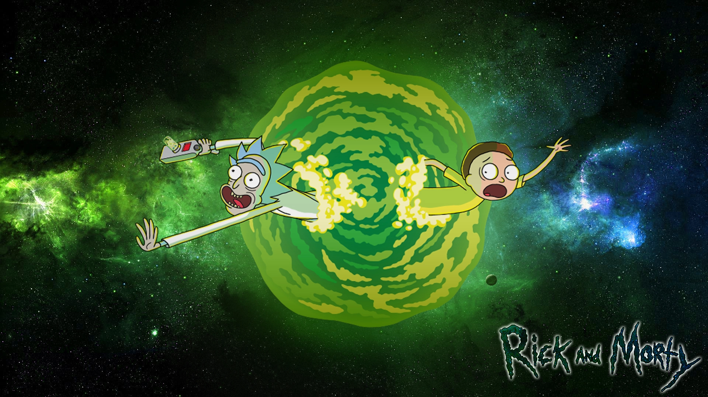
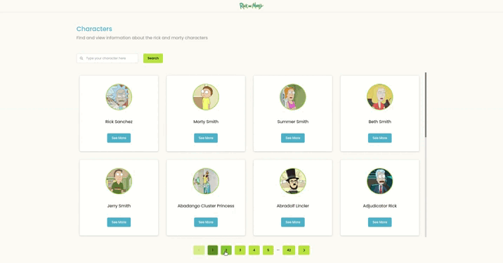
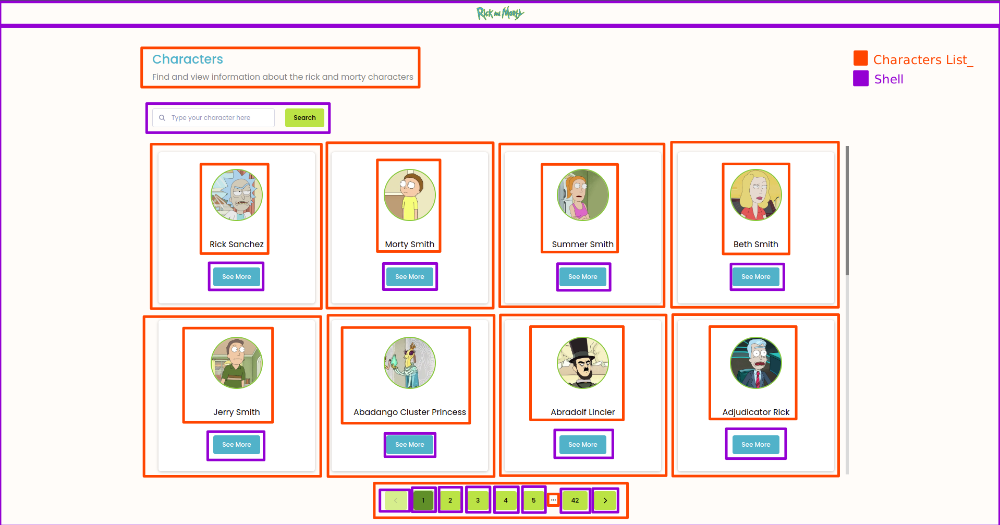
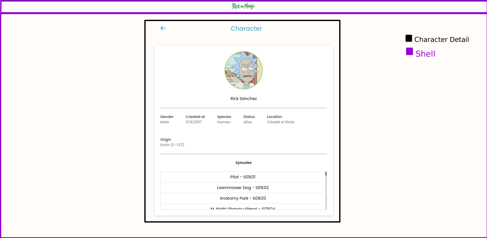

# Micro Front-End - Rick and Morty :octocat:

 

 <a href="#project">👉 Project</a>
 <a href="#micro">👉 About Micro Front-End</a>
 <a href="#technologies">👉 Technologies</a>
 <a href="#execution">👉 Execution</a>
 <a href="#author">👉 Author</a>

 
<h2 id="project">Project</h2>
 

This project shows all the characters from the rick and morty cartoon and is intended for my studies in GraphQL and Micro Front-end.
 
 
The Prototype of this project can be found in this [link from figma](https://www.figma.com/file/FPX7V6jGhKiznnKc31LuYh/ricky-and-morty-project?node-id=0%3A1).
 

 

<h2 id="micro">About Micro Front-End</h2>

 

In this project i followed the [Micro Front-end model](https://martinfowler.com/articles/micro-frontends.html) , it has been divided into 3 different projects that communicate with each other at runtime: 

 
<h3>Shell</h3>
this project is the root of all the others, it is responsible for orchestrating the routing of the application and rendering all the micro front-ends. It is also responsible for housing all global components of the application, such as buttons, inputs and header.

 
<h3>Characters list</h3>
this project is responsible for rendering the listing of all the characters in the drawing.
 
 

 
<h3>Character Details</h3>
this project is responsible for rendering all the details of a character in specific.
 
 

 

<h2 id="technologies">Used Technologies</h2>

 

This project was developed with the following technologies:

 

- <a target="_blank" href="https://nodejs.org/en/">Node 16.13</a>
- <a target="_blank" href="https://reactjs.org/">React 18.0</a>
- <a target="_blank" href="https://graphql.org/">GraphQL 16.6</a>
- <a target="_blank" href="https://github.com/prisma-labs/graphql-request">GraphQL Request</a>
- <a target="_blank" href="https://www.typescriptlang.org/">TypeScript 4.5.4</a>
- <a target="_blank" href="https://webpack.js.org/">Webpack 5</a>
- <a target="_blank" href="https://tanstack.com/query/v4/?from=reactQueryV3&original=https://react-query-v3.tanstack.com">React-Query</a>
- <a target="_blank" href="https://www.radix-ui.com/">Radix-UI</a>
- <a target="_blank" href="https://fontawesome.com/">Font Awesome</a>
- <a target="_blank" href="https://stitches.dev/">Stitches</a>
- <a target="_blank" href="https://eslint.org/">ESLint</a>
- <a target="_blank" href="https://jestjs.io">Jest</a>
- <a target="_blank" href="https://testing-library.com/">Testing Library</a>

 

<h2 id="execution">👨🏻‍💻 Execution</h2>
 

To run the project:
 

- First we have to:
  - Clone the project by running this command in the terminal `git clone <repo_url>`;
       
       

- Open the shell project folder in the terminal and run:
  - `yarn` or `npm install` -> To install all dependencies;
  - `yarn start` or `yarn start:live` -> To run the project;
          
- Open the CharactersList project folder in the terminal and run:
  - `yarn` or `npm install` -> To install all dependencies;
  - `yarn start` or `yarn start:live` -> To run the project;
          
- Open the CharactersDetails project folder in the terminal and run:
  - `yarn` or `npm install` -> To install all dependencies;
  - `yarn start` or `yarn start:live` -> To run the project;
          

  
 :warning: <strong>note: it is necessary to run the 3 projects simultaneously.</strong>

  

<h2 id="author">👨🏻‍💻 Author</h2>

 

<h4>Luiz Fellipe<h4> 

 

